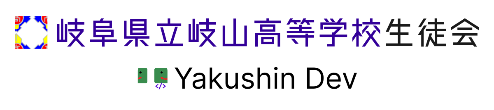

# 岐山高等学校 生徒会

生徒会が運営するリポジトリです。  
デジタル技術を活用し、学校をより良くすることを目標に取り組みをしています。

## 概要

ウェブ技術と運営ノウハウを組み合わせて、岐山祭等の学校行事における「体験価値の最大化」を目標にシステム開発を行っています。

## メンバー募集中！

プログラミングに興味関心があり、開発などに協力してくださるメンバーを募集しています。生徒会執行部、ボランティアどちらの形態でも募集しています。
関心のある方は生徒会メンバーにお尋ねください。

---

## 主要プロジェクト

### Yakushin+

文化祭・体育祭の参加者＆運営向けオールインワンアプリ。

**対象行事**  
- 文化祭
- 体育祭
- 球技大会

## 実施内容と成果

### 文化祭（例）
- 各企画の詳細紹介をアプリに集約
- スタンプラリー機能による、来場の促進  
- 紙配布や口頭連絡の削減により運営負担を軽減

### 体育祭（例）
- 競技進行状況・招集時刻のリアルタイム反映を実現  
- 得点集計をシステム化し、運営の得点集計をリアルタイムで参加者向けサイトでも反映
- パーソナルエージェントによる出場種目や個人スケジュールの即時確認

